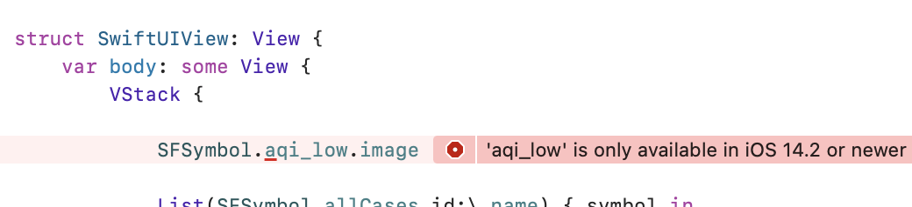

# SFSymbolEnum

A swift package to have SF Symbols available as enum instead of verbatim strings.

You can write now:
```swift
Image(systemImage:.person)
Label("Text",systemImage:.zl_rectangle_roundedtop_fill)
```

Or to see a list of all available symbols
```swift
struct SwiftUIView: View {
    var body: some View {
        VStack {
            List(SFSymbol.allCases,id:\.name) { symbol in
                Label(symbol.name,systemImage:symbol)
            }
        }
    }
}
```
 

## Advantages

- Compiler warning when you mistype a SFSymbol name
- Autocompletion and suggestion for all SFSymbols
- Images are *available* depening on os and version like this:

 

## Installation

- Add the package to your project: Xcode->Add Package Dependency add this url: https://github.com/jollyjinx/SFSymbolEnum
- Import in files like this:
```swift 
     import SFSymbolEnum
```


## Usage 

functions that are using the *systemImage* argument can be used as before, but instead with the dot notation. 
Symbol names translate to enums by replacing dots with underbars. Symbol names starting with a decimal are translated to begin with underbar.

## How it's done

The code itself has been created with the name_availablity.plist inside the SF Symbols application and looks like this
```swift
public enum SFSymbol:String  // this enum will be generated
{
    @available(iOS 13.0,macOS 10.15,tvOS 13.0,watchOS 6.0,*) case `_0_circle`
    @available(iOS 13.0,macOS 10.15,tvOS 13.0,watchOS 6.0,*) case `_0_circle_fill`
...
}


public extension SFSymbol:CaseIterable
{
    static var allCases:[SFSymbol] {
                var allCases:[SFSymbol] = []
    if #available(iOS 13.0,macOS 10.15,tvOS 13.0,watchOS 6.0,*){ allCases.append(SFSymbol.`_0_circle`) }
    if #available(iOS 13.0,macOS 10.15,tvOS 13.0,watchOS 6.0,*){ allCases.append(SFSymbol.`_0_circle_fill`) }
...
    return allCases	
    }
}

```

