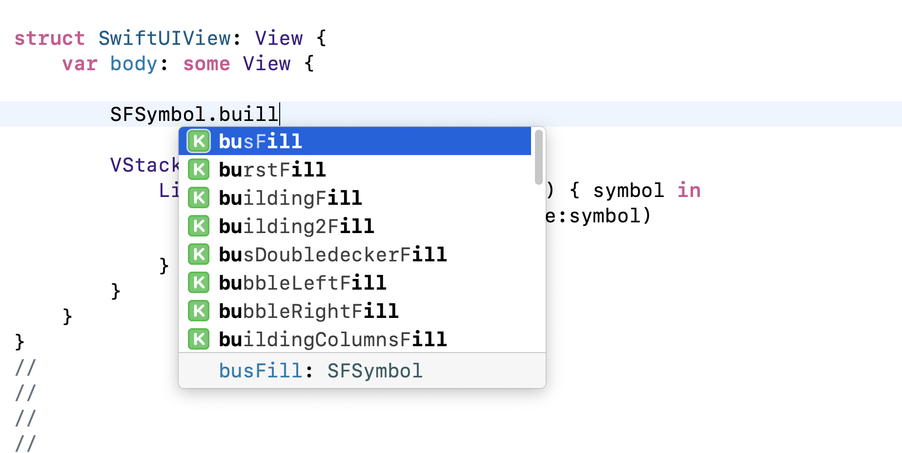
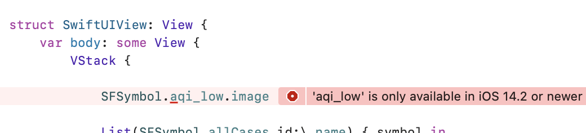

# SFSymbolEnum

A Swift package that exposes SF Symbols as typed values instead of verbatim strings.

Build with Xcode 26 / Swift 6.2 or newer.

You can write now:
```swift
Image(systemImage:.person)
Label("Text",systemImage:.zlRectangleRoundedtopFill)
```

Or to see a list of all available symbols
```swift
struct SwiftUIView: View {
    var body: some View {
        VStack {
            List(SFSymbol.allCases,id:\.name) { symbol in
                Label(symbol.name,systemImage:symbol)
            }
        }
    }
}
```
 

## Advantages

- Compiler error when you mistype a SFSymbol name
- Autocompletion and suggestion for all SFSymbols:

 


- Images are *available* depending on os and version like this:

 

## Installation

- Add the package to your project: Xcode->Add Package Dependency add this url: https://github.com/jollyjinx/SFSymbolEnum
- Import in files like this:
```swift 
     import SFSymbolEnum
```


## Usage 

functions that are using the *systemImage* argument can be used as before, but instead with the dot notation.
Symbol names translate to static members by replacing dots notation to camelcase and prefixing starting numbers with number.

Examples:
```swift
    Image(systemName:"arrow.down.left.circle.fill")
    Image(systemName:"0.circle")
    Image(systemName:"arrow.2.circlepath.circle")
```    
becomes to:
```swift
    Image(systemName:.arrowDownLeftCircleFill)    
    Image(systemName:.number0Circle)    
    Image(systemName:.arrow2CirclepathCircle)    
```

## How it's done

The generated code is created from `name_availability.plist` inside the SF Symbols application.
Symbols are generated as static members instead of enum cases to keep Swift compiler memory usage predictable:
```swift
public struct SFSymbol: RawRepresentable, Hashable, Sendable {
    public let rawValue: String
}

public extension SFSymbol {
    @available(iOS 13.0, macOS 10.15, tvOS 13.0, visionOS 1.0, watchOS 6.0, *) static let number0Circle = SFSymbol(uncheckedRawValue: "0.circle")
    @available(iOS 13.0, macOS 10.15, tvOS 13.0, visionOS 1.0, watchOS 6.0, *) static let number0CircleFill = SFSymbol(uncheckedRawValue: "0.circle.fill")
...
}
```

`SFSymbol.allCases` is backed by a generated resource file, so the compiler does not need to type-check a giant array of every symbol.
